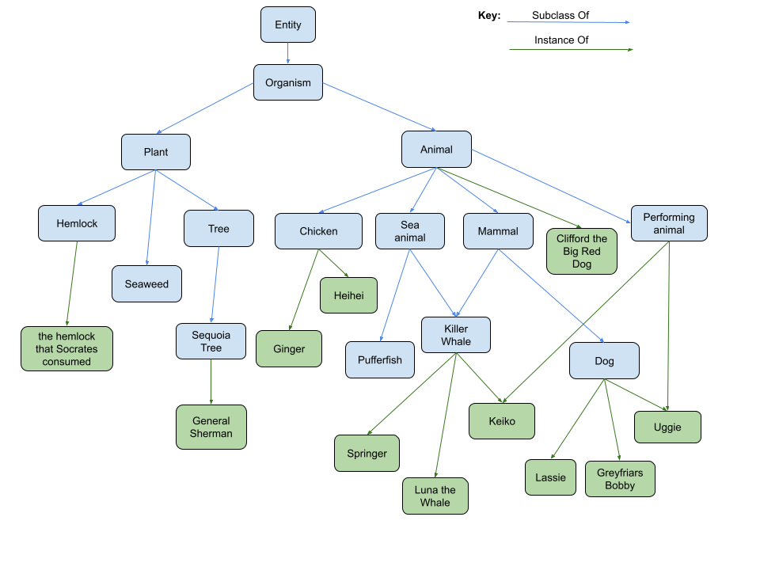

# Take-Home Project - Ontology of Life

## Ontology of Life

In this project, we'll be investigating how the world can be categorized.
In information science, one way of doing this is to use an [ontology](https://en.wikipedia.org/wiki/Ontology_(information_science)).
An ontology represents collections of entities, concepts and data by showing the categories they belong to, the
properties they have, and any relations between them.

A simple example ontology is shown in the graph below:

This ontology uses edges that represent either the 'Instance Of' or 'Subclass Of' relationships between entities.
This graph can be represented as a table of edges as shown below:

| Edge Type    | Head Entity    | Tail Entity     |
| ------------ | -------------- | --------------- |
| SubclassOf   | Organism       | Entity          |
| SubclassOf   | Animal         | Organism        |
| InstanceOf   | Lassie         | Dog             |
| ...          | ...            | ...             |

In addition, an ontology can be used to represent more than just a class tree.
It can be extended to include additional edge types, such as 'Has Attribute', as shown below:

| Edge Type    | Head Entity     | Tail Entity     |
| ------------ | --------------  | --------------- |
| HasAttribute | Pufferfish      | Poisonous       |
| HasAttribute | Heihei          | Accident-prone  |
| ...          | ...             | ...             |

Taking three arbitrary entities `X`, `Y` and `Z`, these 3 edge types abide by the following rules:
* If `X` is an instance of `Y`, and `Y` is a subclass of `Z`, then `X` is also an instance of `Z`.
  * E.g. if Lassie is an instance of dog, and dog is a subclass of mammal, then Lassie is also an instance of mammal.
* If `X` is a subclass of `Y`, and `Y` is a subclass of `Z`, then `X` is also a subclass of `Z`.
  * E.g. if dog is a subclass of mammal, and mammal is a subclass of animal, then dog is also a subclass of animal.
* If `X` has the attribute `Y`, and `Z` is an instance of `X`, then `Z` also has the attribute `Y`.
  * E.g. if dog has the attribute 4-legged, and Lassie is an instance of dog, then Lassie also has the attribute
    4-legged.

### Goal

An ontology corresponding to the one pictured above (but also including some 'Has Attribute' edges) is provided in
tabulated format in each directory (e.g. `python/data/ontology.csv` for Python).

The goal is to build a simple system that can use the provided ontology to answer questions that
match the following templates:
* "Is `X` a `Y`?" / "Is `X` an `Y`?" (i.e. "is `X` an instance of `Y`?")
  * Example: Is Lassie a dog?
  * Note: you should support both `a` and `an` variations, but for simplicity don't worry about checking whether the 
    correct one is used - e.g. you should answer "Is Lassie an dog?" the same as "Is Lassie a dog?".
* "Is `X` a type of `Y`?" (i.e. "is `X` a subclass of `Y`?")
  * Example: Is dog a type of animal?
* "Is `X` considered to be `Y`?" (i.e. "does `X` have the attribute `Y`?")
  * Example: Is Luna the Whale considered to be aquatic?

The requirements of this system are:
* It **only** needs to be able to answer questions that match the templates above (i.e. with `X`/`Y` replaced with
  entities from the data), and only when we have the required data to answer the question.
* It must be able to gracefully handle questions in other formats, but does not need to be able to answer them.

You do not need to worry about capitalization / formatting of words (e.g. "two-legged" vs "two legged"). All questions
will be asked using the same representation as in the data you have been provided.

### Getting Started
To get started, pick whether you will be using `java-maven`, `java-gradle` or `python` and move to that directory. In 
both languages, we have provided some boilerplate code to get you started. There is also a test suite set up with a 
couple of failing testcases to provide an example of the functionality required. You will want to get these tests 
passing, and also add any additional tests needed to be confident in your solution. Each language directory has a 
`README` that gives information on how to run the tests and also on how to run linting, which has been set up for you.

### Large ontology
There is a larger ontology in the same data directory called `ontology-large.csv`, with corresponding tests. We recommend you build and test your
code against the smaller ontology first, but the tests that use the larger ontology should pass too once you're done!  

### Tips
* This ontology is not perfect or complete. As a result, we can't rely on something being false
  purely because it doesn't exist in the ontology. Some examples of this are:
  * From the graph, we know that 'Clifford the Big Red Dog' is an animal, but we can't know that he is specifically 
  a dog (because there is no connection between 'Clifford the Big Red Dog' and 'dog').
  * Similarly, if we ask "is a tree a type of animal?", then the answer should be "don't know". This is
  because we can't infer that the answer is "no" just because there is no connection - it may be that the connection is
  just missing from our data set.
  * If we ask "is Lassie a pet?", then the answer should be "don't know", because we don't have any
  information about pets, and so we can't prove the result either way.
* In addition to solving this toy problem, we're very interested in how your solution can be extended and how it can
  be scaled to work with e.g. large datasets (even bigger than the large CSV file). We'll discuss this during the
  interview, so there's no need to add support for it or write anything down about it, but it's worth bearing this in
  mind as you go along.
